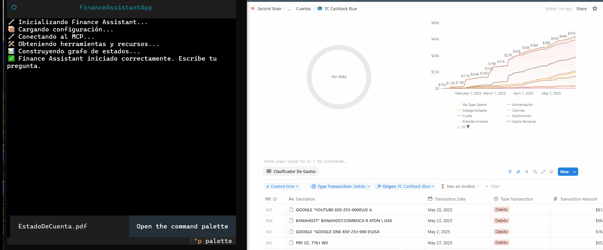
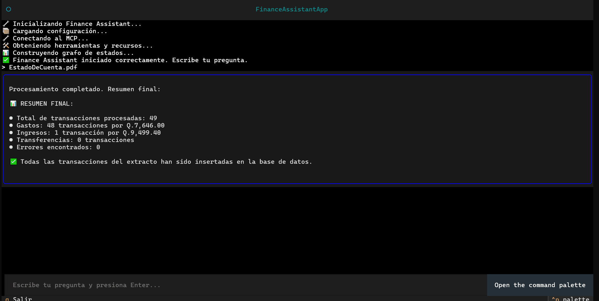

# MCP Finance Assistant

## Description

MCP Finance Assistant is a modular, terminal-based financial assistant that connects with Notion and can leverage LLMs (OpenAI, Mistral, Anthropic) to help you manage, analyze, and track your finances with ease.  
It uses a client-server architecture: the client is built in Python (Textual UI, LangGraph agents), and the server (Node.js/TypeScript) acts as an MCP tool provider, integrating with your Notion databases.

---

## Features

- Terminal UI (TUI) for a fast, distraction-free experience.
- Modular, graph-based agent design (LangGraph, LangChain).
- Native Notion integration for storing and querying accounts & transactions.
- Extensible with OpenAI, Mistral, or Anthropic for advanced AI responses.
- Clean separation of client (Python) and server (Node/TypeScript, MCP).
- Easy configuration with environment variables.

---

## 📸 Demo GIFs

See MCP Finance Assistant in action! Below are sample use cases you can try, with animated GIFs for each scenario.

---

### 1. Uploading a Bank Statement

This demo shows how to quickly load a new bank statement so transactions are automatically recognized and added.



---

### 2. Asking About a Specific Expense Type

Ask about your spending in a particular category, such as food, transportation, or utilities.

**Example:**  
_User types:_  

How much did I spend on food last month?



---

### 3. Dashboard Notion

You can visual dashboard
 

## Quick Start

### 1. Clone the repository

```bash
git clone https://github.com/your-username/mcp-finance-assistant.git
cd mcp-finance-assistant
```

---

### 2. Install `uv` (if you don’t have it)

```bash
pip install uv
```

---

### 3. Set up the Python virtual environment (client)

```bash
uv sync
source .venv/bin/activate        # On Windows: .venv\Scripts\activate
```

---

### 4. Install server dependencies and Build

```bash
cd servers/finance
npm install
npm run build 
cd ../../
```

---

### 5. Configure your environment variables

#### a. Prepare the `.env` files

For  `client/`

```bash
cp .env-template .env
```
Then fill out each field in the new `.env` file:

```ini
OPENAI_API_KEY=your_openai_api_key         # (optional) For LLM features
MISTRAL_API_KEY=your_mistral_api_key       # (optional) For LLM features
NOTION_API_KEY=your_notion_integration_token
NOTION_DB_ACCOUNTS=your_notion_db_accounts_id
NOTION_DB_TRANSACTIONS=your_notion_db_transactions_id
```

> **Never commit your `.env` file!** Only commit `.env-template` as an example.

#### b. How to get your Notion credentials:

- **NOTION_API_KEY**:  
  Create an integration at [notion.com/my-integrations](https://www.notion.com/my-integrations) and copy your secret.
- **NOTION_DB_ACCOUNTS** and **NOTION_DB_TRANSACTIONS**:  
  Copy the database ID from the Notion database URL (everything after your workspace name and before the `?`).

Make sure you share your databases with the integration you created!

---

### 7. Start the client

```bash
cd client
uv run main.py
```

---

## Notion Template

**Important:**  
Before using the assistant, you must duplicate the official Notion template to your workspace.

👉 [Click here to duplicate the Finance OS template to your Notion](https://tremendous-circle-eb7.notion.site/Finance-OS-22c764d59d8c80418fe6c358b892c790)

This project expects two databases in Notion:

1. **Accounts**
    - Example properties: Name (title), Type (select), Balance (number), Currency (select), Active (checkbox)
2. **Transacciones**
    - Example properties: Name (title), Date (date), Account (relation to Accounts), Amount (number), Type (select), Category (select)

> After duplicating the template, make sure to share both databases (“Accounts” and “Transacciones”) with your Notion integration.  
> Then, copy the IDs of each database and add them to your `.env` file as described above.


---
## 🤖 Using as an MCP Tool with Claude

MCP Finance Assistant can also be used as an [MCP](https://docs.anthropic.com/en/docs/tools-and-mcp) tool, making it available to Anthropic's Claude models for advanced agent workflows.

### How to Expose the Finance Tool as an MCP Server

The server component (`servers/finance`) is fully compatible with the Model Context Protocol (MCP) and can be used as an external tool for Claude or other LLMs supporting MCP.

#### 1. Configure Your `.env` (as above)

Make sure your Notion API credentials and database IDs are set in the `.env` for `servers/finance`.


## FAQ

**Q:** My app won’t connect to Notion!  
**A:** Check your `.env` credentials, that you shared the databases with your integration, and that the database IDs are correct.

**Q:** I see “Error during initialization”  
**A:** Make sure the server is running before starting the client, and double-check your dependencies and environment variables.

---

## License

MIT

---

## Author

[Jorge Monterroso](https://www.linkedin.com/in/jorge-monterroso-nowell-5b8b68134/)  
Open to contributions and feedback!